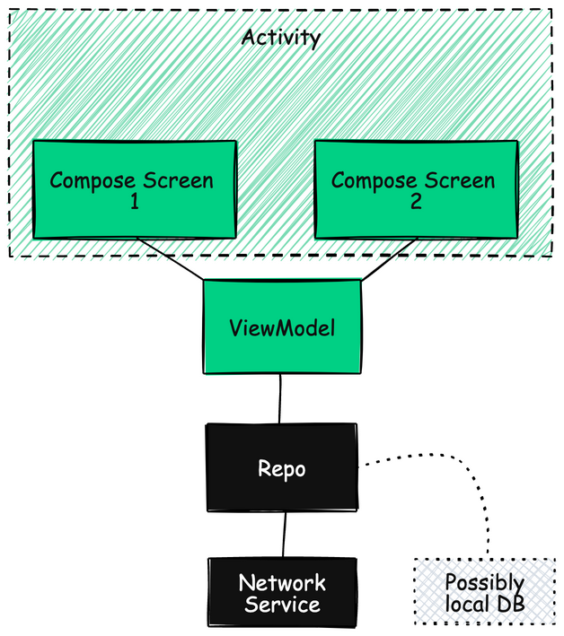

# Android Minimalist Template
A minimalist template with networking, Compose, and Flow.

UI tests can be done on [Maestro](https://maestro.mobile.dev/). One example is given in [Intro.yaml](https://github.com/smuzani/android-minimalist-template/blob/main/app/src/maestro/Intro.yaml).

Thanks to [https://randomuser.me/](https://randomuser.me) for the free sample API.

Reminder: Rename `Template` and the package name to your app name.
